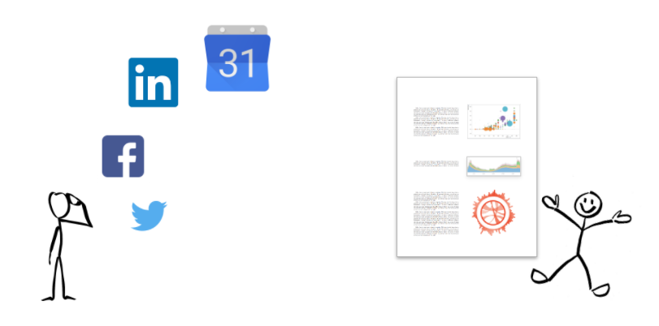

# ANALYSIS OF SOCIAL MEDIA DATA

## Team GROUP BY

Browsing, interacting, and creating content on social media has become a way of life for many people. Although one's [personal Facebook data](https://www.facebook.com/help/131112897028467), [Twitter data](https://support.twitter.com/articles/20170160#), and other social media data can be downloaded, there appears to be a dearth of tools to facilitate analysis of that data--for example, [NameGenWeb](https://github.com/oxfordinternetinstitute/NameGenWeb) was created by the Oxford Internet Institute to assist Facebook users in exporting their networks, but the tool is no longer maintained or usable. 

Because we believe that social media users--not only marketers--deserve to understand their social media behavior, we are attempting a tool project that will enable users to gain very simple insights into their social media use. In addition to providing some summary of activities on each platform, we anticipate enabling users to explore several questions that depend on integration of data sources:

- Do their levels of activity across different social media platforms rise and fall together, or do they cycle between one platform or another? 
- What times of day do they tend to be most active on social media?
- How does their social media activity compare with their other activities, for example, how often does social media activity overlap with scheduled events?
