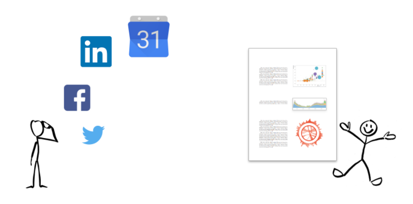

# ANALYSIS OF SOCIAL MEDIA DATA

## Project Description



Browsing, interacting, and creating content on social media has become a way of life for many people. Although some or all of one's social media data can often be downloaded, there appears to be a dearth of tools to facilitate analysis of that data--for example, [NameGenWeb](https://github.com/oxfordinternetinstitute/NameGenWeb) was created by the Oxford Internet Institute to assist Facebook users in exporting their networks, but the tool is no longer maintained or usable. 

Because we believe that social media users--not only marketers--deserve to understand their social media behavior, we are attempting a tool project that will enable users to gain very simple insights into their social media use. Currently, our tool is capable of ingesting datasets from **Facebook, LinkedIn, Twitter, and Google Calendar.** In addition to providing some summary of activities on each platform, we anticipate enabling users to explore several questions that depend on integration of data sources:

- Do their levels of activity across different social media platforms rise and fall together, or do they cycle between one platform or another? 
- What times of day do they tend to be most active on social media?
- How does their social media activity compare with their other activities, for example, how often does social media activity overlap with scheduled events?


## Getting Started

### Install

Installation makes our code available as a [command line tool](https://github.com/UWSEDS-aut17/groupby#use-the-tool-command-line) as well as a Python module that can be imported and used within your own code:

- Clone the github repo: [https://github.com/UWSEDS-aut17/groupby.git](https://github.com/UWSEDS-aut17/groupby.git)
- From the command line, navigate to the repo and run these commands:
  - `pip install .`
  - `pip install -r requirements.txt`
  
#### Uninstall

- `pip uninstall groupby`

#### Testing

- `python setup.py test`

### Obtain your data

To use this tool, you must download and unzip ***at least one*** of these datasets from a personal social media account (note that there can be a delay of a day or so, depending on the platform):

- Facebook - [Official instructions](https://www.facebook.com/help/131112897028467)
- Twitter - [Official instructions](https://support.twitter.com/articles/20170160#)
- LinkedIn - [Official instructions](https://www.linkedin.com/help/linkedin/answer/50191/accessing-your-account-data?lang=en)

Calendar data can be analyzed ***in addition*** to one or more social media datasets:

- Google Calendar - [Official instructions](https://support.google.com/calendar/answer/37111?hl=en)

### Use the tool (command line)

| Option | Argument | Example Argument |
| --- | --- | --- |
| -T, --twitter | Path to Twitter data directory | ~/Downloads/Twitter |
| -F, --facebook | Path to Facebook data directory | ../backups/Facebook12-20-2014 |
| -L, --linkedin | Path to LinkedIn data directory | data |
| -C, --calendar | Path to Calendar data file | ~/Documents/mycal.ics |
| -O, --output | Path to desired report output location | ~ |

The simplest use case is to analyze a **single social media dataset:** 

```
groupby -T path/Twitter_directory -O ~/Desktop
```

You can analyze **multiple social media datasets** simultaneously but separately: 

```
groupby -T path/Twitter_directory -F path/Facebook_directory -O ~/Desktop
```

Finally, you can analyze **all social media datasets in conjunction with calendar data:** 

```
groupby -T path/Twitter_directory -F path/Facebook_directory -C path/Google_Calendar_directory -L path/Twitter_directory -O ~/Desktop
```


