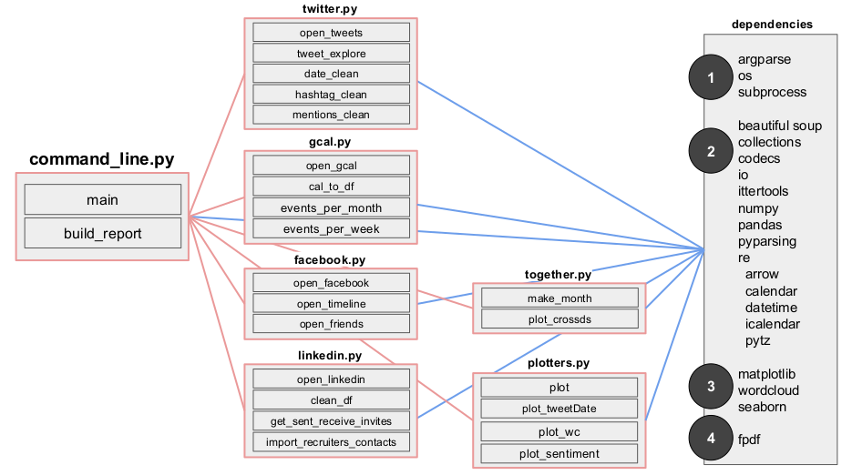

# Component design

 

## Component list

| Name | Purpose | Input | Output | 
| --- | --- | --- | --- |
| command_line.py | Supports command line tool | Arguments from command line | PDF report to user |
| facebook.py | Opens, cleans, and aggregates Facebook data | Arguments from command line | pandas dataframes |
| gcal.py | Opens, cleans, and aggregates Google Calendar data | Arguments from command line | pandas dataframes, matplotlib figures |
| linkedin.py | Opens, cleans, and aggregates LinkedIn data | Arguments from command line | pandas dataframes |
| twitter.py | Opens, cleans, and aggregates Twitter data | Arguments from command line | pandas dataframes |
| plotters.py | Creates data visualizations | pandas dataframes | matplotlib figures |
| together.py | Combines dataframes and visualizes all together | pandas dataframes | matplotlib figure |

 

## Component specifications

### command_line.py

#### main()

- **Description:**
- **Inputs:**
- **Outputs:**

#### build_report()

- **Description:**
- **Inputs:**
- **Outputs:**

### facebook.py

#### open_facebook()

- **Description:** Facebook gives us multiple html files, that are parsed into Python using beautifulsoup.
- **Inputs:**
  - ***Friends.html*** - contains data about your list of friends, when you became friends with them, and the people you decided to terminate your friendship with. These are hidden in the 'div class = contents', and will be unwrapped into a pandas dataframe for information to display the social activeness since the inception of the user account.
  - ***Timeline.html*** - contains data about the activity on the user's timeline / profile. Here the necessary information will be extracted from 'div class = 'meta' and 'div class = comment', fed into a pandas dataframe to show the activity of the user over time, and whether there are any specific months which see higher usage.
- **Outputs:** - The outputs are the necessary dataframes needed for future / next functions, stripped of the html content.

### linkedin.py

#### open_linkedin()

- **Description:** For LinkedIn, types of connections and invites sent/received are being analyzed. This will show what period was one most active in and their interaction with LinkedIn in terms of amount of time spent in networking per week.
- **Inputs:**
  - ***Connections.csv*** - contains data about LinkedIn connections, with the following features/columns:
    - First Name - Name
    - Last Name - Name
    - Position - Connection title/position
    - Company - Name of the company my connection works in
    - Connected_On - Date
  - ***Invitations.csv*** - contains data about invitations sent and received on LinkedIn, grouped by week with the following features/columns:
    - From - Invitation Sender's Name
    - To - Invitation Receiver's Name
    - Sent At - Date at which Invitation was sent/received.
    - Message - Message string
    - Direction - INCOMING / OUTGOING.
- **Outputs:** The ouputs are dataframes obtained by reading the input csv files, with the same features/columns.  

### twitter.py

#### open_tweets()

- **Description:** We are analyzing trends in twitter usage to identify periods where the user is most active on the platform. We will also identify the top hashtags and mentions by the user during the selected date range.
- **Inputs:**
  - ***tweets.csv*** - contains data about tweets posted by the user, with the following features/columns:
    - tweet_id - Unique numeric identifier column for tweets
    - in_reply_to_status_id - Numeric identifier if user is responding to an existing tweet
    - in_reply_to_user_id - Numeric source tweet user id
    - timestamp - Tweet timing
    - text - The actual tweet
    - retweeted_status_id - Unique numeric id if retweeted, null otherwise
    - retweeted_status_user_id - Numeric ID of user who retweets
    - retweeted_status_timestamp - Time of retweet
    - expanded_urls - Contains any URLs posted with the tweet
  - We will be loading the the above csv file, on to a pandas dataframe for subsequent analysis.
- **Outputs:** The ouput is a dataframes obtained by reading the input csv files, with the same features/columns.

### gcal.py

#### open_gcal()

- **Description:** The objective is to analyze calendar events, duration and frequency over a 1 year period.
- **Inputs:** The ics file format contains the following attributes:
   - ***calendar.ics*** - This is the raw calendar format file which contains all the events in the user's calendar.
        - BEGIN: Beginning of an event or alarm. Values are VEVENT/ALARM
        - DTSTAMP:20170323T082322Z
        - LOCATION:Location of Event.
        - DESCRIPTION: Description of the event
        - ORGANIZER: Event organizer
        - SEQUENCE: Whether this is a repeated event. Values are 1/0
        - SUMMARY: Event title/summary
        - DTSTART: Timestamp for event start
        - DTEND: Timestamp for event end
        - CREATED: Event created on date
        - RRULE: Rule defined if the event is recurring
- **Outputs:** Same as above, the idea is to transform the ics to a pandas DataFrame format for easier analysis.

### together.py

#### make_month()

- **Description:**
- **Inputs:**
- **Outputs:**
